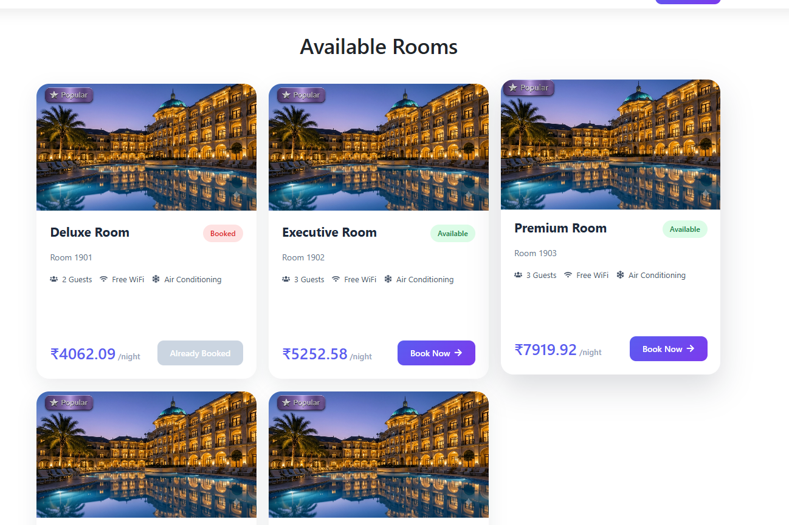
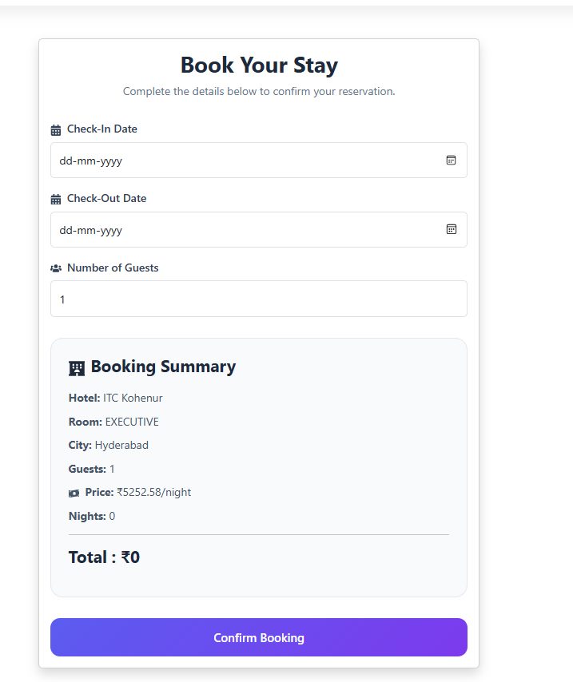
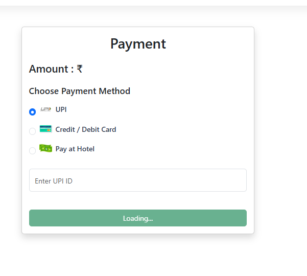
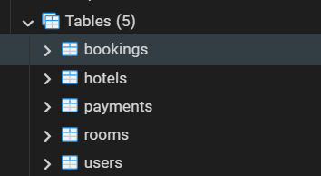

# 🏨 Hotel Reservation System

A full-stack Hotel Reservation System built using **Spring Boot**, **React**, and **PostgreSQL**. Users can browse hotels, view available rooms, make bookings, and complete payments through a modern web interface.

---

## 🚀 Features

- Browse hotels
- View hotel details
- View available rooms
- Book hotel rooms
- Payment page with multiple payment methods
- Dynamic room pricing
- Hotel images
- Responsive UI
- REST API architecture
- PostgreSQL database integration

---

## 🛠 Tech Stack

### Backend
- Java 21
- Spring Boot
- Spring Data JPA
- Hibernate
- PostgreSQL
- Maven

### Frontend
- React
- React Router
- Axios
- Bootstrap
- CSS
- React Icons

### Database
- PostgreSQL

---

## 📂 Project Structure

```
Hotel-Reservation-System
│
├── hotel-reservation-backend
│   ├── src
│   ├── pom.xml
│   └── application.properties
│
└── hotel-reservation-frontend
    ├── src
    ├── public
    └── package.json
```

---

## ⚙ Installation

### Clone Repository

```bash
git clone https://github.com/anuragkc46/Hotel-Reservation-System.git
```

### Backend

```bash
cd hotel-reservation-backend
```

Configure PostgreSQL inside

```
application.properties
```

Run

```bash
mvn spring-boot:run
```

Backend runs at

```
http://localhost:8080
```

---

### Frontend

```bash
cd hotel-reservation-frontend
```

Install dependencies

```bash
npm install
```

Run

```bash
npm run dev
```

Frontend runs at

```
http://localhost:5173
```

---

## 🗄 Database

Database used:

```
PostgreSQL
```

Tables

- Hotels
- Rooms
- Bookings
- Payments
- Users

---

## 📸 Screenshots

### 🏠 Home Page


---

### 🏨 Hotels Page

Browse available hotels with ratings, locations, and images.


---

### 🛏️ Rooms Page

View available rooms, pricing, capacity, and book your preferred room.



---

### 📅 Booking Page

Select check-in/check-out dates and confirm your booking.



---

### 💳 Payment Page

Complete payment using UPI, Card, or Cash at Hotel.



---

### 🗄️ Database Schema

PostgreSQL database containing Hotels, Rooms, Users, Bookings, and Payments.


---

## 🔮 Future Improvements

- JWT Authentication
- User Login & Registration
- Booking History
- Admin Dashboard
- Search & Filters
- Hotel Reviews
- Email Confirmation

---

## 👨‍💻 Author

**Anurag Kumar**

GitHub:
https://github.com/anuragkc46
